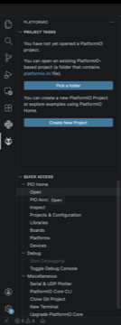
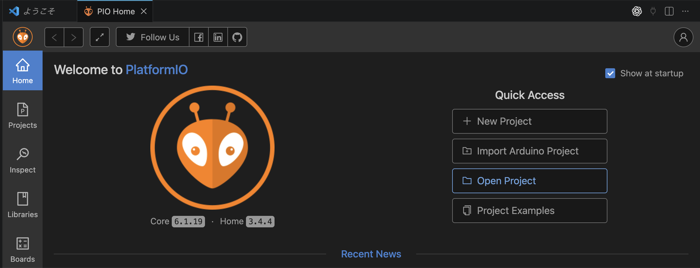
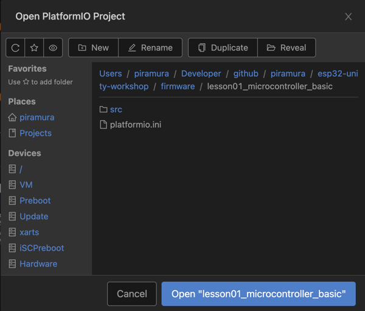
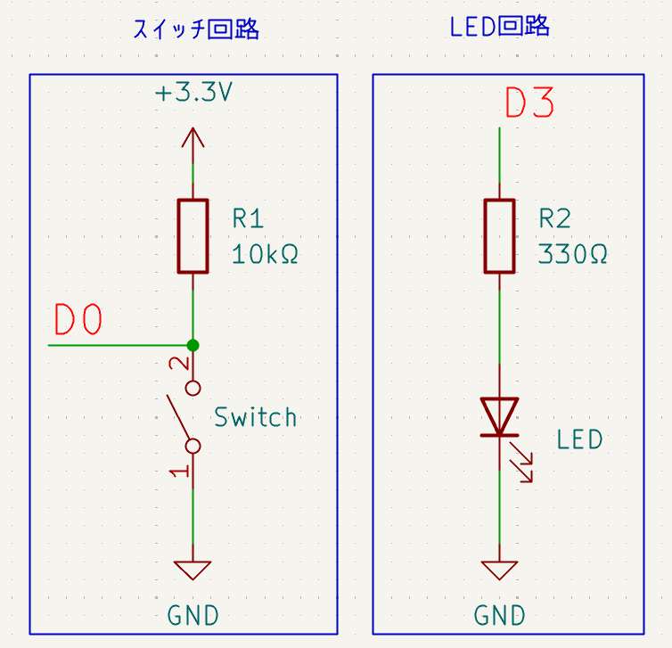
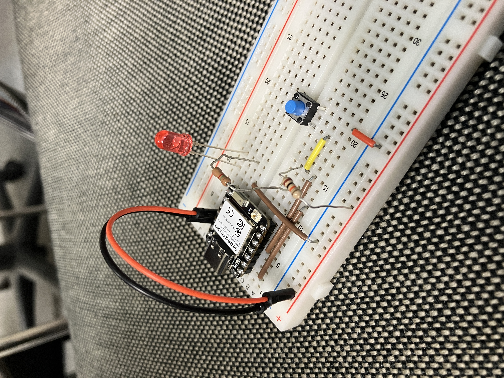

# 第1回：マイコンのみ

# ゴール
マイコン、センサー、アクチュエータといったマイコン関連の基本事項を知ってもらい、実際にSeeed Studio XIAO ESP32C6を用いてセンサーを読み取れることを確認し、LEDをチカチカさせます。

# この回の流れ
1. GitHubからレポジトリを持ってくる
1. VScodeの拡張機能のPlatformIO・SerialMonitorを入れる
1. PlatformIOでプロジェクトを開く
1. マイコンのはんだ付け
1. LEDとタクトスイッチの回路作り
1. PlatformIOプロジェクトをコンパイルできるようにする
1. マイコンとシリアル通信
1. マイコンでLEDチカチカ
1. マイコンでスイッチ読んでLEDを光らせる
1. 時間あったらセンサー・アクチュエータ紹介

# GitHubからレポジトリを持ってくる
GitHubからレポジトリを持ってきます。
https://github.com/piramura/esp32-unity-workshop 

# VScodeの拡張機能のPlatformIO・SerialMonitorを入れる
VScodeを開いて拡張機能を入れましょう。
1. VScodeの拡張機能を入れます。拡張機能からPlatformIOと調べて、アリのようなアイコンのものを入れます。入れるところまでは[このサイト](https://qiita.com/nextfp/items/f54b216212f08280d4e0)が参考になりそうです。
1. また、SerialMonitorと調べてMicroSoftのSerialMonitorを入れます。

ここまで来たら、一旦VScodeを閉じます。
1. 何も開いていない新しいVScodeのウィンドウを出します。
1. ここで、拡張機能として左側にアリマークが増えるので、押します。
1. PlatformIOのPIO Homeのタブが出てくると思う(出てこなければOpen)のでOpenボタンを押します。



PIO Homeが開いたらOpen Projectを押します。



1. ここで、GitHubから持ってきた中の以下のフォルダを選択してOpenを押します。```esp32-unity-workshop\firmware\lesson01_microcontroller_basic```



こっから**めちゃくちゃ**時間がかかるので違う作業に移ります。

# マイコンのはんだ付け
その場で教えるので特に書かないでおきます。

# LEDとタクトスイッチの回路作り
プログラムを書き込む前に回路を作りましょう。
ブレッドボードに部品を挿していきます。
部品一覧
- はんだ付けしたマイコン
- LED
- タクトスイッチ
- 約10kΩ抵抗
- 200Ω以上の抵抗なんでも
- ジャンパワイヤー

回路図は以下のようになります。一応、回路図は上の方が電圧高いです。
LEDは足の長い方が電圧高い方です。
D0とD3はマイコンのピン名です。この教材では、ボタンをD0、LEDをD3につなぎます。ピンの位置は[XIAO ESP32C6のピンマップ](../images/lesson02/XIAO_ESP32-C6_front_pinout.png)を見ると分かります。



サンプルはこれです。



ジャンパワイヤを使ってどんどんつなげてみましょう。一応チェックしてから電源入れるので見せてください。

# PlatformIOプロジェクトをコンパイルできるようにする
回路が終わったころにはPlatformIOの初期化が終わってると思うので一旦そのままコンパイルできるか試します。
PlatformIOを動かしてるときだけVScodeの左下にいろんなマークが出ます。その中のチェックマークを押してみましょう。コンパイルが始まります。
エラーが出たら教えてください。

環境構築の鬼門がここなので通ればあとはスムーズです。

# マイコンとシリアル通信・マイコンでLEDチカチカ・マイコンでスイッチ読んでLEDを光らせる
これ以降は写経タイムです。src/main.cppの中身を一旦全部消して、写経してみましょう。
コードの下に解説を置いておきます。また、関数は検索かけると出てくるので、自分でも調べてみると良いかもです。
名前がそのままの意味なので意外と予想が付きやすいかもしれません。　

写経ができたらマイコンをケーブルでパソコンとつないで、右下にある→(右矢印)マークを押してちょっと待つと書き込まれます。エラーが出たらどこかがおかしいので見直してみましょう。  
Try and Errorでどんどん書き込みましょう。

解説付きコード
```
#include <Arduino.h>

const int pinLed = D3;
const int pinButton = D0;

void setup() {
  Serial.begin(115200);
  pinMode(pinLed, OUTPUT);
  pinMode(pinButton, INPUT);
}

void loop() {
  // 段階的に書いていこう。一番下のdelay(1000);だけは先に書こう
  
  Serial.println("Hello from XIAO ESP32C6");

  // ここまでで書き込もう1

  int buttonState = digitalRead(pinButton);
  Serial.printf("Button state: %d\n", buttonState);

  // ここまでで書き込もう2

  digitalWrite(pinLed, buttonState);

  // ここまでで書き込もう3

  delay(1000);
}
```

簡単な解説を以下に書きます。
- `#include <Arduino.h>`はArduinoIDEというソフトウェアと互換性を持たせるためのおまじないです。
- `setup`関数と`loop`関数はArduino系の書き方ではどちらもおまじない的に書いておく関数です。
- `setup`関数は最初に一度だけ呼ばれる関数です。ここで初期化などをします。
- `loop`関数は基本的に電源が切れない限りずっとぐるぐると実行され続ける関数です。delayとかで周期を変えられます。  
- `const int pinLed = D3;`では、定数を定義してます。ピンの名前に対応するD3やD0といったものは`#define`で定義されていて、それぞれ21、0という数字が割り当てられてます。  
- `Serial.begin(115200);`では、パソコンとの通信開始しています。115200は通信速度です。割と一般的な速度です。  
- `pinMode(pinLed, OUTPUT);`では、GPIOピンを入力(INPUT)と出力(OUTPUT)の指定を行います。スイッチを読み取るpinButtonは入力、LEDを光らせるpinLedは出力といった具合です。  
- `Serial.println("Hello from XIAO ESP32C6")`では、文字をパソコンに送ります。つまるところマイコン版printfです。  
- `digitalRead(pinButton)`では、指定したピン番号の入力を読んで0か1を返します。GNDとつながってたら0、3.3Vとつながってたら1が返ってくるといった具合です。  
- `digitalWrite(pinLed, buttonState)`では、指定したピン番号に3.3VかGNDかを出力させることができます。buttonStateのところが1なら3.3V、0ならGNDがかかります。  
- `delay(1000)`では、指定したミリ秒だけマイコンの動作を止めます。今回のように簡単な時間制御に使えますね。時間制御にはmillis()や割り込みといった若干高難易度な方法もあります。  

# 時間あったらセンサー・アクチュエータ紹介
時間ができたらnotionのハードウェアのところに[センサー概要](https://www.notion.so/36f6876c2979800fa737d00bcf6d99fb?source=copy_link)、[アクチュエータ概要](https://www.notion.so/36f6876c297980949939f203a9407283?source=copy_link)が書いてあるので見てみましょう。
