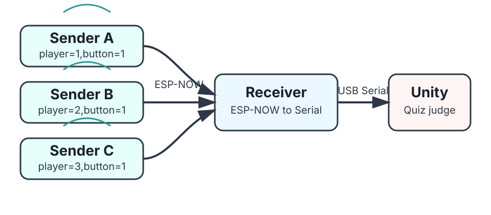
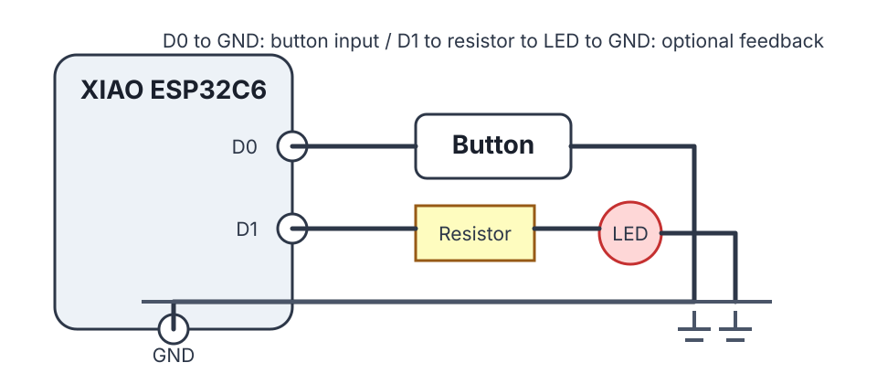
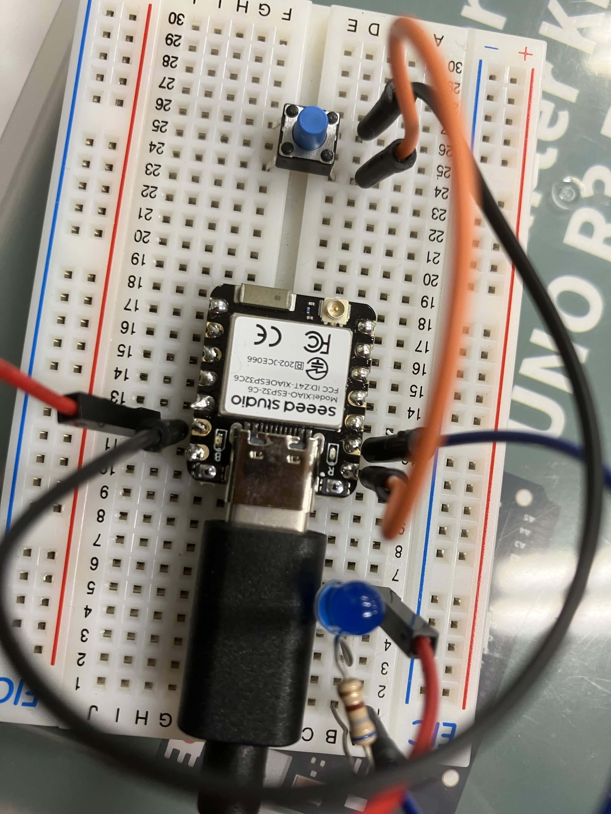
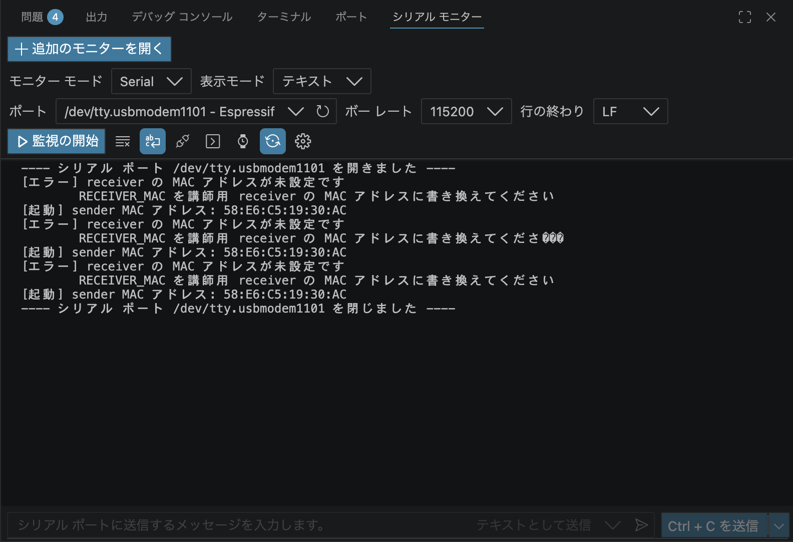
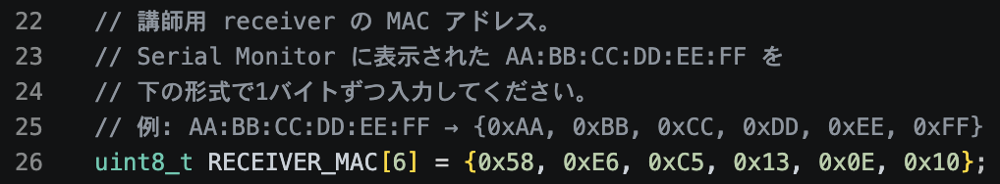
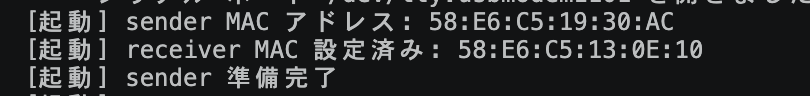
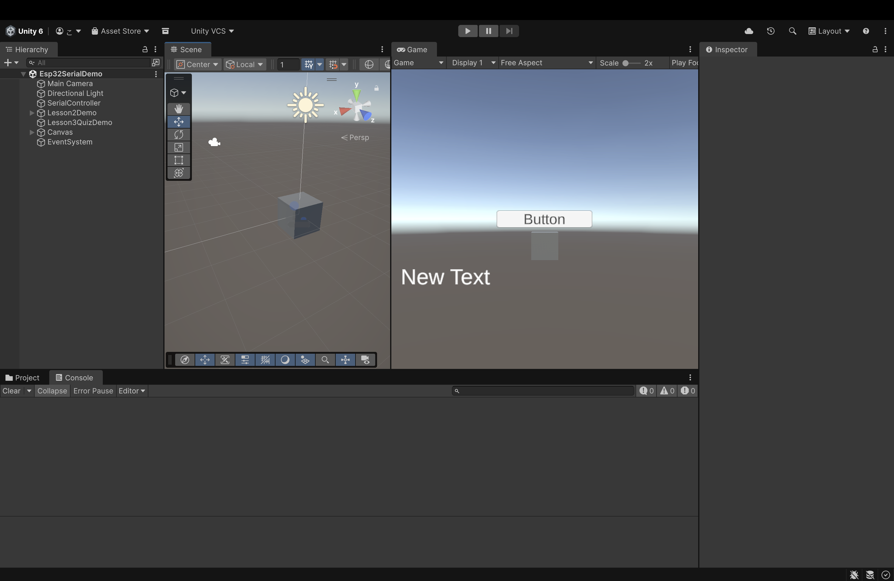
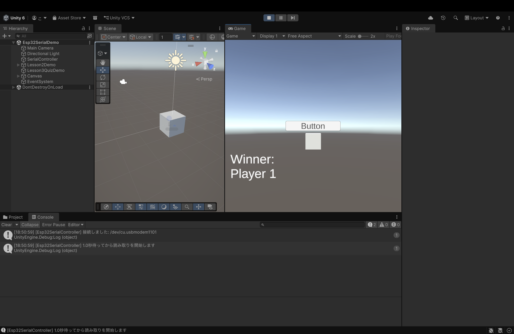
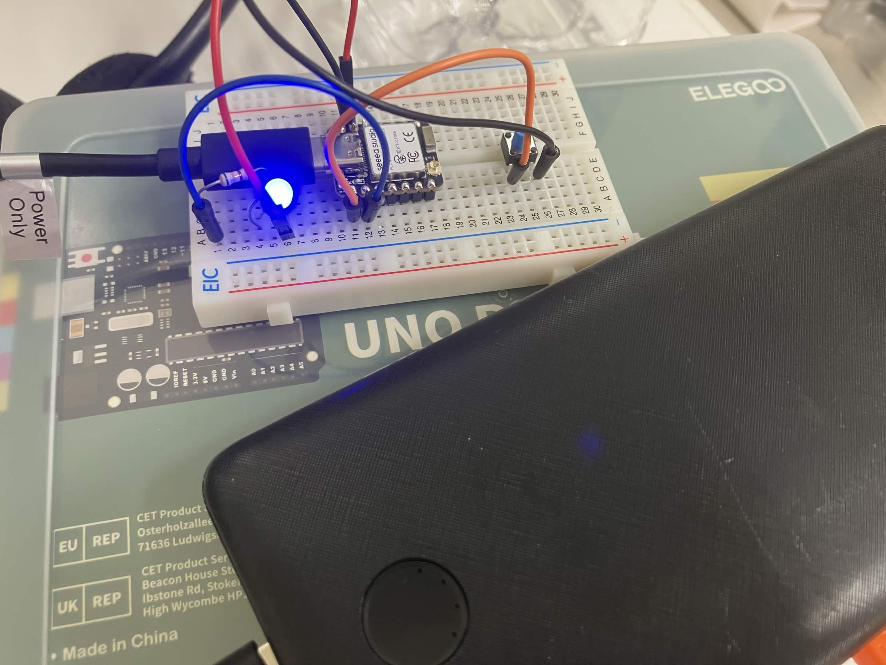
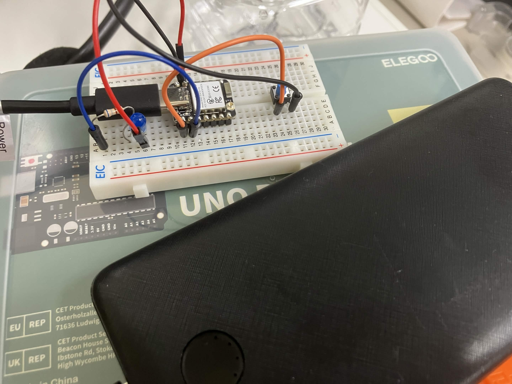

# 第3回：ESP-NOWで無線早押しクイズ

## ゴール

参加者のESP32を無線早押しボタン（sender）として使い、講師が用意したESP32（receiver）を通してUnity上の早押しクイズに参加できるようにします。

この講習では、ファームウェアとUnityスクリプトは完成済みのコードを使います。
参加者は `PLAYER_ID` と `RECEIVER_MAC` を変更し、通信の流れを動かして理解します。

第2回では、ESP32とPCをUSB Serialで有線接続しました。
第3回では、その入力部分をESP-NOWで無線化し、会場内の参加者全員が1台の講師用receiverへ接続します。

## 全体構成



### 最小構成（動作確認用）

```text
sender 1台
  ↓ ESP-NOW
講師用 receiver 1台
  ↓ USB Serial
Unity
```

### 本番構成（クイズ実施時）

```text
参加者A sender
参加者B sender
参加者C sender
  ↓ ESP-NOW（それぞれ）
講師用 receiver 1台
  ↓ USB Serial
Unity
  早押しクイズを判定
```

## 役割

| 役割 | 担当 | 内容 |
|---|---|---|
| sender | 参加者 | 自分のESP32を無線早押しボタンとして使う |
| receiver | 講師 | ESP-NOWとUSB Serialのブリッジとして使う |
| Unity | 講師PC | 早押しクイズの判定と表示を行う |

receiver は講師が事前に準備します。参加者がreceiverを書き込む必要はありません。

## sender のピン位置と配線




参加者の sender は、ボタンを `D0`、LED を `D1` につなぎます。



| 部品 | ESP32側のピン | つなぎ方 |
|---|---|---|
| タクトスイッチ | `D0` | `D0` と `GND` の間につなぐ |
| LED | `D1` | `D1` → 抵抗 → LED → `GND` の順につなぐ |

```text
ボタン:
D0 ---- タクトスイッチ ---- GND

LED:
D1 ---- 抵抗 ---- LED ---- GND
```

sender はボタン入力を送信し、receiver から `led=1` / `led=0` が返ってきたら LED を切り替えます。
Unity が勝者を決めると、勝者の sender だけ LED が光ります。

## 使用するフォルダ

### sender

参加者は次の PlatformIO フォルダを開きます。

```text
firmware/esp32_unity_input/lesson03_espnow_play/sender/
```

書き込み前に `PLAYER_ID` と `RECEIVER_MAC` を変更します。

### receiver

講師は次の PlatformIO フォルダを開きます。

```text
firmware/esp32_unity_input/lesson03_espnow_play/receiver/
```

receiver は講師PCにUSB接続して使います。

### Unity

第2回と同じ Unity プロジェクトを使います。

```text
unity/Esp32UnityWorkshop/
```

開くシーンは次のファイルです。

```text
Assets/_Contents/Scenes/Esp32SerialDemo.unity
```

## データ形式

### sender → receiver（ESP-NOW）

第3回では、誰が押したかを識別するために、次の形式でデータを送ります。

```text
player=1,button=1
player=2,button=1
```

- `player` は参加者番号（書き込み時に各自で設定します）
- `button=1` はボタンが押されたことを表します
- Unity側は最初に届いた `player` を勝者として扱います

第2回の `button=0` / `button=1` との違いは `player=N,` が先頭に付く点です。
receiverはこのデータをそのままUSB SerialでUnityへ流します。

### Unity → receiver → sender

Unity は最初に届いた `player` を勝者として扱い、receiver へ次の形式で送ります。

```text
winner=1
winner=2
```

receiver は、保存しておいた `player ID` と sender MAC アドレスの対応を使い、該当 sender へLED命令を返します。

```text
led=1
led=0
```

`ResetButton` を押すと Unity から `clear_leds` が送られ、receiver は全 sender に `led=0` を送ります。

## receiverについて

receiverは講師用ESP32です。参加者はreceiverを操作する必要はありません。

receiverは以下を行います。

- 参加者のsenderからESP-NOWで届いた入力を、USB Serial経由でUnityへ送る
- 入力を受け取ったときに `player ID` と sender MAC アドレスの対応を覚える
- Unityから届いた `winner=N` / `clear_leds` を sender への `led=1` / `led=0` に変換する

当日、receiverはUnityを動かす講師PCにUSB接続された状態で使います。

## 当日の進行手順

### 講師が事前に行うこと

1. `firmware/esp32_unity_input/lesson03_espnow_play/receiver/` をPlatformIOで開く
2. receiverを書き込む
3. Serial Monitorでreceiverの起動ログとMACアドレスを確認する
4. Unityプロジェクトを準備する
5. receiverのMACアドレスを参加者全員へ共有する

### 参加者が行うこと

1. `firmware/esp32_unity_input/lesson03_espnow_play/sender/` をPlatformIOで開く
2. 自分の `player` IDを設定する（講師に番号を確認する。通常は `1` から順番に割り当てる）
3. 講師用receiverのMACアドレスを設定する
4. 自分のESP32へ書き込む
5. ボタンを押してUnity画面で反応することを確認する

## MACアドレスの設定

ESP-NOWでは、送信先のESP32をMACアドレスで指定します。

### 1. receiver の MAC アドレスを確認する

1. receiver を PC に USB 接続する
2. PlatformIO の Serial Monitor を開く（baud rate: `115200`）
3. receiver を書き込むと、起動ログと一緒に MAC アドレスが表示される
4. 表示が見えない場合は、Serial Monitor を開き直してから `RST` と `GND` を一瞬つなぐ
5. 何も表示されない場合は、`platformio.ini` に USB CDC 設定が入っているか確認する

```text
[起動] receiver MAC アドレス: AA:BB:CC:DD:EE:FF
[起動] receiver 準備完了。senderからの入力を待っています...
```


6. 表示された MAC アドレスをメモする

第3回の sender / receiver では、USB Serial に表示するために次の設定を入れています。

```ini
build_flags =
  -DARDUINO_USB_MODE=1
  -DARDUINO_USB_CDC_ON_BOOT=1
```

### 2. sender の MAC アドレスについて

sender の MAC アドレスを参加者が設定する必要はありません。
receiver は sender から入力が届いたときに、送信元MACアドレスと `player` ID の対応を自動で覚えます。
ESP-NOW の受信コールバックには送信元MACアドレスが含まれるため、`player=N,button=1` の中にMACアドレスを入れる必要はありません。

確認用として、sender の起動ログには自分の MAC アドレスが表示されます。

```text
[起動] sender MAC アドレス: 11:22:33:44:55:66
```


`RECEIVER_MAC` が未設定でも、この sender MAC は先に表示されます。
未設定中はエラーメッセージと一緒に sender MAC が繰り返し表示されます。



### 3. sender の RECEIVER_MAC を設定する

sender のコードで `RECEIVER_MAC` を次の形式に変換して設定します。

`AA:BB:CC:DD:EE:FF` → `{0xAA, 0xBB, 0xCC, 0xDD, 0xEE, 0xFF}`

コード例（sender の `main.cpp`）:

```cpp
uint8_t RECEIVER_MAC[] = {0xAA, 0xBB, 0xCC, 0xDD, 0xEE, 0xFF};
```



1文字でも違うと ESP-NOW は届きません。`0` と `O`、`1` と `I` の見間違いに注意してください。

### 4. PLAYER_ID を設定する

sender のコードで `PLAYER_ID` を参加者番号に設定します。

```cpp
const int PLAYER_ID = 1;  // 参加者ごとに異なる番号にする
```


同じ番号を複数人が使うと、勝者の識別ができなくなります。
receiver は最大16人分の `PLAYER_ID` と sender MAC アドレスを記録できます。

### 5. sender を書き込む

1. `firmware/esp32_unity_input/lesson03_espnow_play/sender/` を PlatformIO で開く
2. `RECEIVER_MAC` と `PLAYER_ID` を設定した状態でビルドして書き込む

書き込み後、Serial Monitor に次のような起動ログが出れば sender 側の準備は完了です。



## Unityシーン設定手順

`Assets/_Contents/Scenes/Esp32SerialDemo.unity` を開きます。

Unity Hub で `Open` を選び、`unity/Esp32UnityWorkshop/` フォルダを指定して開きます。
Unity のバージョン選択が出た場合は `6000.3.6f1` を選びます。
初回は `Importing` が終わるまで待ってください。

シーンには第3回用のUIとスクリプトが配置済みです。



| オブジェクト名 | 役割 |
|---|---|
| SerialController | receiver からの Serial 受信を担当する |
| Lesson3QuizDemo | 最初に届いた `player` を勝者として記録する |
| WinnerText | 勝者表示を行う |
| ResetButton | 早押しの受付状態へ戻す |

### 1. Lesson03QuizDemo の接続を確認する

Hierarchy で `Lesson3QuizDemo` を選択し、Inspector の `Lesson03QuizDemo` を確認します。

- `Winner Text` に `WinnerText` が設定されていること
- `Serial Controller` に `SerialController` が設定されていること
- `Waiting Message` が `Waiting...` になっていること
- `Winner Message Prefix` が `Winner: Player ` になっていること

### 2. イベント接続を確認する

Hierarchy で `SerialController` を選択し、`Esp32SerialController` の `On Line Received` を確認します。

- `Lesson03QuizDemo.HandleSerialLine` が登録されていること

次に `ResetButton` を選択し、Button コンポーネントの `On Click` を確認します。

- `Lesson03QuizDemo.ResetQuiz` が登録されていること

### 3. portName を設定する

Hierarchy で `SerialController` を選択し、`portName` を receiver の USB ポート名に変更します。

- macOS: `/dev/cu.usbmodem*` のような形式
- Windows: `COM3` のような形式

ポート名の調べ方:

- **macOS**: ターミナルで `ls /dev/cu.*` を実行し、receiver を抜き差しして増減するものが対象ポート
- **Windows**: デバイスマネージャー → 「ポート (COM と LPT)」に表示される `COM*` が対象ポート
- **PlatformIO 共通**: Serial Monitor を開くと上部にポート名が表示される

## 動作確認

### 1. sender → receiver の通信を確認する

1. receiver を講師 PC に USB 接続する
2. PlatformIO の Serial Monitor を開く（baud rate: `115200`）
3. sender のボタンを押す
4. Serial Monitor に `player=N,button=1` が表示されることを確認する
5. **Serial Monitor を閉じる**（開いたままだと Unity が同じポートを開けない）

### 2. receiver → Unity の動作を確認する

1. Unity で Play を開始する
2. sender のボタンを押す
3. Unity の `WinnerText` に勝者が表示されることを確認する（例: `Winner: Player 1`）
4. 勝者の sender のLEDだけが光ることを確認する
5. `ResetButton` を押すと `Waiting...` に戻り、LEDが消えることを確認する







## 早押しクイズの流れ

```text
1. Unityが受付開始状態になる
2. 参加者がsenderのボタンを押す
3. receiverが player=ID,button=1 をUnityへ送る
4. Unityが最初に届いたplayerを勝者として記録する
5. Unity画面に勝者を表示する
6. Unityが `winner=ID` をreceiverへ送る
7. receiverが勝者のsenderへ `led=1` を送る
8. `ResetButton` でUnityが `clear_leds` を送り、receiverが全senderへ `led=0` を送る
```

## 発展

### 複数senderのID管理

参加者ごとに `player` IDを割り当てます。
書き込み前に各自のIDを確認し、コードに設定してから書き込みます。

### たけのこニョッキ風ゲームへの応用

複数のsenderを使い、参加者がボタンを押した順番やタイミングをUnity側で判定します。
ESP32側はボタン入力とLED表示を担当し、ゲームルールはUnity側に持たせます。

### 無線ボタンのケースを作る

Fusion 360 や Bambu Studio を使って、ESP32とボタンが入るケースを3Dプリントすると、持ちやすい無線早押しデバイスになります。

## 詰まりやすい点

- senderを書き込む前に、receiverのMACアドレスが設定されているか確認する
- MACアドレスの桁や区切りを間違えていないか確認する
- receiverをUnityを動かすPCにUSB接続しているか確認する
- Serial Monitorを開いたままUnityをPlayしていないか確認する
- senderの電源が入っているか確認する
- player IDが正しく設定されているか確認する
- 第2回のUnity Serial受信がまだ動いていない場合は、先に第2回を完成させる

## トラブルシューティング

[トラブルシューティング](troubleshooting.md) を参照してください。
